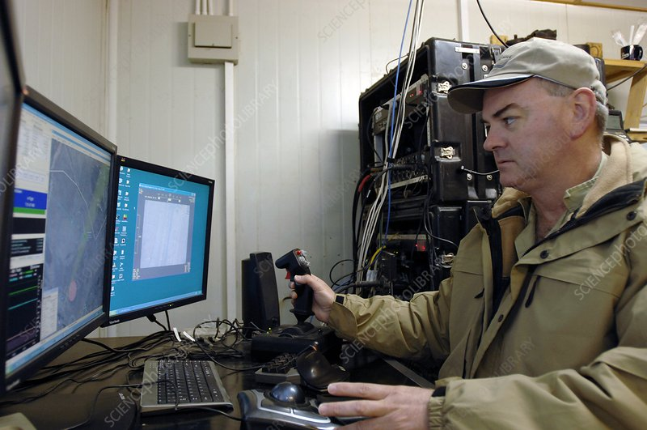

# HACKATHON CHALLENGE - WEB INTERFACE
For this team the challenge is to develop an interface for the robot so that a remote operator can be located anywhere in the world. This interface should be web-browser based and display in real-time the relevant information that the operator might need. This could include streamed video from the two cameras, what the robot is currently doing (i.e. picking, moving, waiting) and other information such as the battery level, gps coordinates, how many daffodils have been picked etc.. The operator should also be able to send commands to the robot by using either a joystick or keyboard and mouse.

How the interface will look and feel is up to you, as are the specific packages and frameworks. Feel free to experiment and implement creative solutions. There are no wrong answers!

Don't forget to document your creations. Happy coding!

- Kernow Robotics.

hello test
