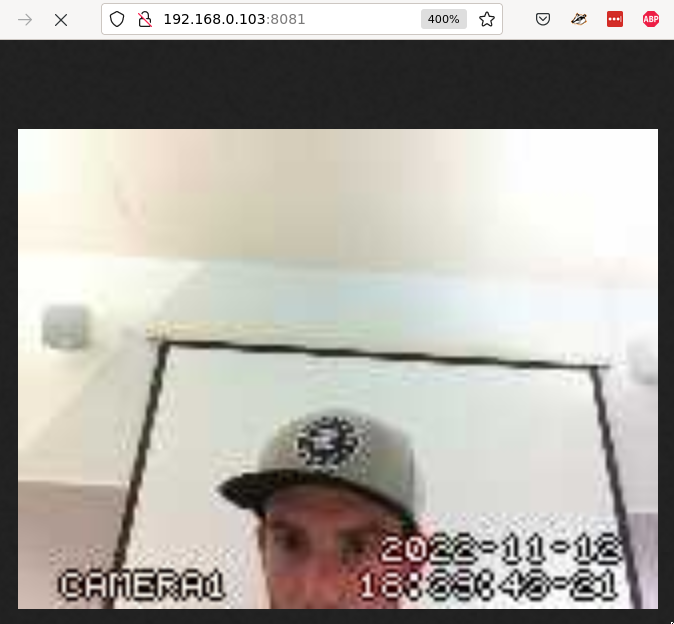

# Outline
This doc contains setup info and links to resrouces for various linux/ camera 
things.

### Realsense-D415 on Thinkpad T440p (Ubuntu 20.04) via docker
Install docker and docker-compose
```bash
chmod +x ubuntu_20_04_docker_install.sh
. ubuntu_20_04_docker_install.sh
```
Added [Intel Realsense D415](https://github.com/AlfredWilmot/docker-ros-realsense) docker
container repo as submodule
```bash
# adding submodule "git submodule add https://github.com/iory/docker-ros-realsense"
# setup submodules after pulling
git submodule update --recursive --init
```
give docker-containers access to X11 display on host machine (to view camera feed
on host machine from container)
```bash
xhost +
```
Deploy!
```bash
docker compose up -d
```


### Streaming USB-camera to localhost (Debian)

Your Rpi needs to be connected to the same network as your dev-laptop.
Such as the `Robot Lab` network:
```bash
#SSID:  Robot Lab
#p/w:   killallhumans 
```
By default, the video-stream will only be available to devices on this local-network (i.e. 
not available to external clients via the internet).

Install prerequisites, and ensure your camera is detected by the Rpi (might need 
to install drivers if missing-- this is beyond the scope of this README):
```bash
#Install motion package
sudo apt-get purge motion
sudo apt-get install motion

# check that your camera is detected by the pi
lsusb
```

Setup the motion-package config files:
```bash
# Modify motion config files for automatic streaming:
# /etc/default/motion
# /etc/motion/motion.conf

# Copy over the config files saved in this repo in the ./motion-config/ folder
# e.g. 
# <pi-user-name> = pi
# <pi-ip_address> = 192.168.0.103
scp ./motion-config/motion.conf <pi-user-name>@<pi-ip_address>:/etc/motion/motion.conf
scp ./motion-config/motion <pi-user-name>@<pi-ip-address>:/etc/default/motion
```
Restart the pi and your camera should automatically start streaming to `<pi-ip_address>:8081`.
e.g. type `192.168.0.103:8081` into your dev-laptop browser and you shold see something like this:



Resources:
- [Streaming camera feed to localhost on Rpi](https://www.instructables.com/How-to-Make-Raspberry-Pi-Webcam-Server-and-Stream-/)
- [Improving camera feed framerate](https://raspberrypi.stackexchange.com/questions/106078/very-slow-with-motion-server-raspberry-pi-://raspberrypi.stackexchange.com/questions/106078/very-slow-with-motion-server-raspberry-pi-b) 
- [copying over ssh (scp)](https://unix.stackexchange.com/questions/106480/how-to-copy-files-from-one-machine-to-another-using-ssh)

### Setup wifi/ethernet drivers (attempt)

